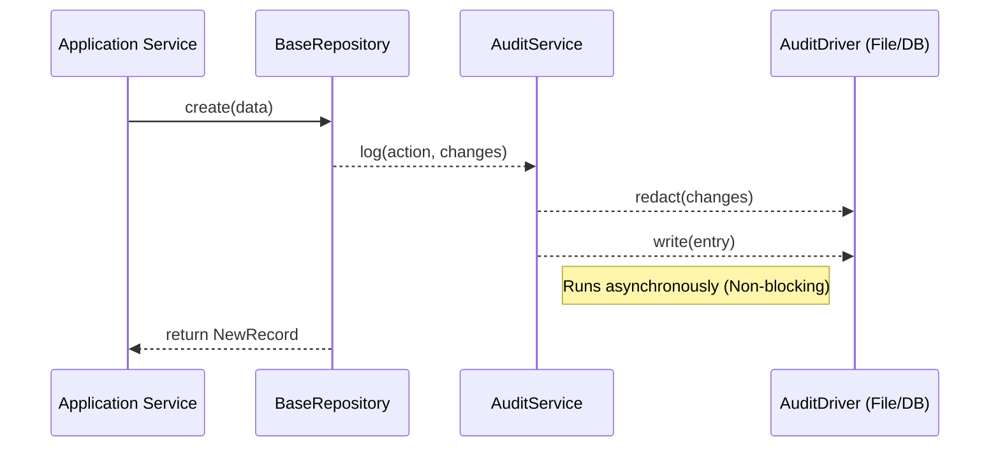
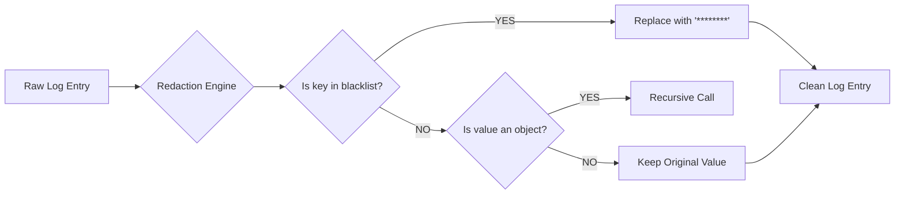

# Asynchronous Audit Logging 📝

EliteNest includes a high-performance auditing system designed for enterprise compliance without sacrificing API performance.

## Key Features
- **Asynchronous**: Logging is "fire and forget", ensuring no impact on request latency.
- **Driver-based**: Supports multiple backends (PostgreSQL, Local Files).
- **Security-first**: Automatically redacts sensitive fields like passwords.
- **Daily Rotation**: File-based logs are automatically rotated to manage disk space.

## Configuration

You can toggle the audit log driver in your `.env` file:

```bash
AUDIT_LOG_DRIVER=file # Options: database, file
AUDIT_LOG_PATH=logs/audit
```

## How it Works

The `AuditService` orchestrates events. When a write operation occurs (usually via `BaseRepository`), an audit event is triggered.



## Data Redaction Engine Flow

To ensure PII safety, EliteNest processes all logs through a recursive redaction engine.



## PII Redaction

To comply with privacy standards (GDPR, etc.), EliteNest automatically masks sensitive fields in the `changes` column:

```json
{
  "email": "user@example.com",
  "password": "********"
}
```

The redaction logic searches for keywords like `password`, `token`, `secret`, and `key` recursively within the audit entry.
