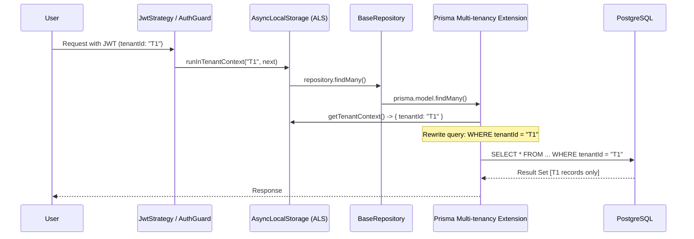

# Transparent Multi-tenancy 🏢

EliteNest implements multi-tenancy at the lowest possible layer of the application: the database driver. This ensures that developers can focus on business logic without worrying about leaking data between customers.

## How it Works

The implementation relies on two core technologies:
1.  **AsyncLocalStorage (ALS)**: Stores the `tenantId` of the current request context globally across the call stack.
2.  **Prisma Extensions**: Intercepts every database operation to inject filters automatically.

### The Flow of a Request

1.  **Authentication**: The `JwtStrategy` extracts the `tenantId` from the JWT payload.
2.  **Context Injection**: The `JwtStrategy` uses `runInTenantContext(tenantId, ...)` to wrap the rest of the request execution.
3.  **Database Call**: When any repository method is called, the Prisma Extension reads the `tenantId` from the active ALS context.
4.  **Auto-Filtering**: Prisma modifies the SQL query on the fly:
    - `SELECT * FROM Product` becomes `SELECT * FROM Product WHERE tenantId = 'current-tenant-id'`.

## Internal Execution Flow



## Code Reference: The Extension

```typescript
// libs/core/src/database/prisma-extensions.ts

export const multiTenancyExtension = Prisma.defineExtension((client) => {
  return client.$extends({
    query: {
      $allModels: {
        async $allOperations({ model, operation, args, query }) {
          const context = getTenantContext();
          if (context?.tenantId) {
            // Automatically inject tenantId into filters
            args.where = { ...args.where, tenantId: context.tenantId };
          }
          return query(args);
        },
      },
    },
  });
});
```

## Benefits
- **Security**: Eliminates the class of bugs where a developer forgets to filter by `tenantId`.
- **Developer Experience**: Repositories look like standard, single-tenant code.
- **Auditability**: We can easily trace every database read to a specific tenant context.
