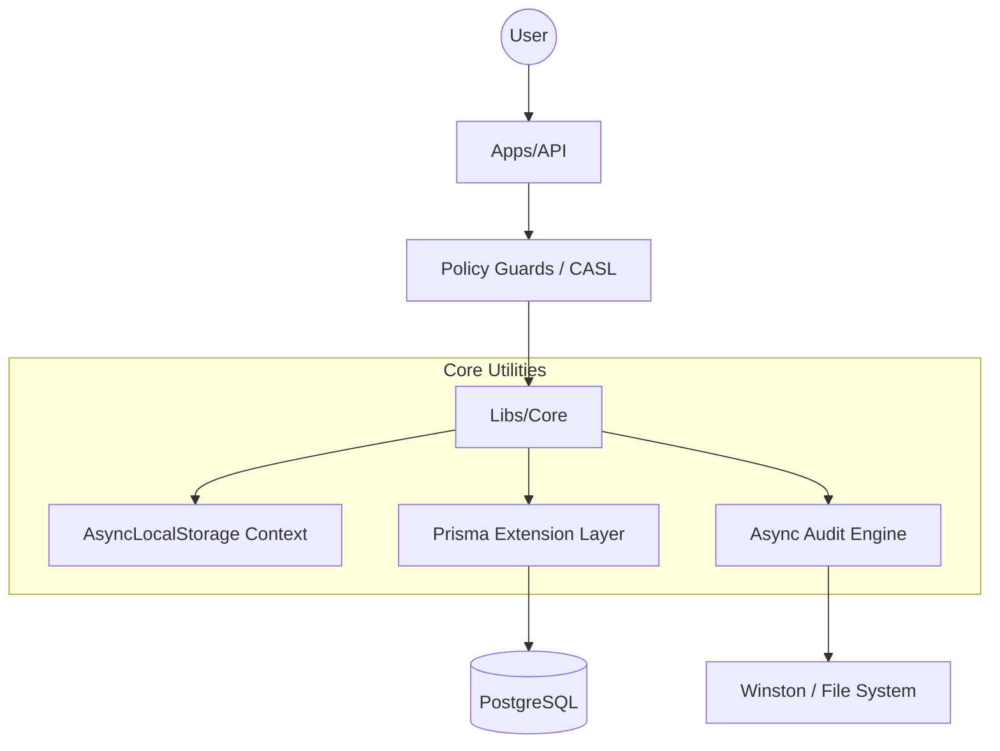
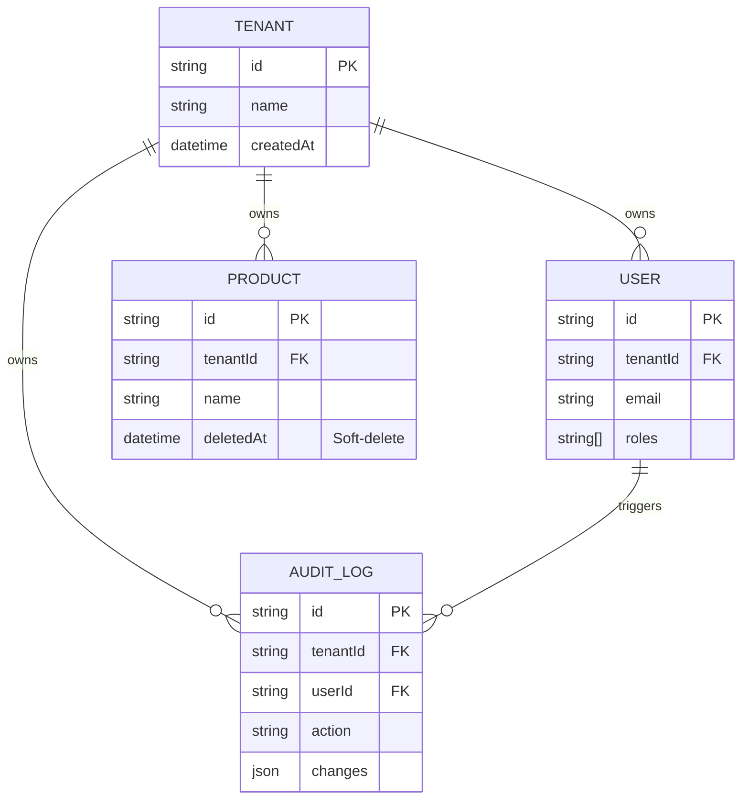

# Principal-Level Guide 🛡️

Welcome to the internal mechanics of EliteNest. This guide is designed for senior and principal engineers who need to understand the "Why" and the "How" behind the framework's core abstractions.

## Core Architectural Insight

The fundamental design goal of EliteNest is **Transparent Governance**. We believe that critical cross-cutting concerns—like multi-tenancy, soft-deletion, and audit trailing—should be handled by the infrastructure, not the business logic.

### Comparison: Procedural vs. Transparent Multi-tenancy

In a traditional implementation (e.g., Python/Django), you might manually filter Every. Single. Query.

```python
# Procedural (Risky)
def get_products(request):
    return Product.objects.filter(tenant_id=request.tenant.id)
```

In EliteNest, we use **Prisma Extensions** combined with **AsyncLocalStorage** to inject this context at the database driver level.

```typescript
// EliteNest (Transparent)
// The developer just calls:
const products = await this.repository.findMany();

// The infrastructure automatically appends:
// WHERE tenantId = 'current-context-id' AND deletedAt IS NULL
```

## System Architecture



## Core Entity Relationships (ERD)



## Design Trade-offs

1.  **Asynchronous Auditing**: We chose a "fire and forget" model for audit logs. 
    - **Pro**: API latency is unaffected by disk I/O.
    - **Con**: In the event of a catastrophic system failure immediately after a write, a log entry *could* be lost. For high-compliance financial data, this can be switched to synchronous mode in the `AuditDriver`.
2.  **Global Middleware**: `FrameworkModule` is marked as `@Global()`. 
    - **Trade-off**: Increases initial bootstrap time slightly, but eliminates "forgotten dependency" bugs across the monorepo.

## Where to go deep
1.  **The Context Provider**: [libs/core/src/database/base.repository.ts](file:///Users/ninja/projects/base/elitenest/libs/core/src/database/base.repository.ts)
2.  **The Middleware Glue**: [libs/core/src/auth/strategies/jwt.strategy.ts](file:///Users/ninja/projects/base/elitenest/libs/core/src/auth/strategies/jwt.strategy.ts)
