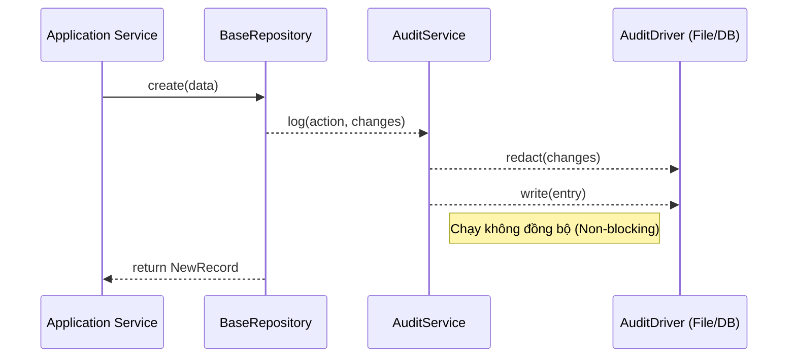

# Nhật ký Audit không đồng bộ 📝

EliteNest bao gồm một hệ thống auditing hiệu năng cao, được thiết kế cho các yêu cầu tuân thủ của doanh nghiệp mà không làm ảnh hưởng đến tốc độ của API.

## Các tính năng chính
- **Không đồng bộ (Asynchronous)**: Việc ghi log là mô hình "fire and forget", đảm bảo không ảnh hưởng đến độ trễ của request.
- **Dựa trên Driver**: Hỗ trợ nhiều backend lưu trữ (PostgreSQL, File cục bộ).
- **Ưu tiên Bảo mật**: Tự động ẩn (redact) các trường nhạy cảm như mật khẩu.
- **Xoay vòng hàng ngày**: Các log file được tự động xoay vòng để quản lý dung lượng đĩa.

## Cấu hình

Bạn có thể thay đổi driver cho audit log trong file `.env`:

```bash
AUDIT_LOG_DRIVER=file # Tùy chọn: database, file
AUDIT_LOG_PATH=logs/audit
```

## Cách thức hoạt động

`AuditService` đóng vai trò điều phối. Khi một thao tác ghi dữ liệu xảy ra (thường là qua `BaseRepository`), một sự kiện audit sẽ được kích hoạt.



## Ẩn thông tin nhạy cảm (PII Redaction)

Để tuân thủ các tiêu chuẩn quyền riêng tư (GDPR, v.v.), EliteNest tự động che giấu các trường nhạy cảm trong cột `changes`:

```json
{
  "email": "user@example.com",
  "password": "********"
}
```

Logic ẩn thông tin sẽ tìm kiếm các từ khóa như `password`, `token`, `secret`, và `key` một cách đệ quy trong bản ghi audit.
