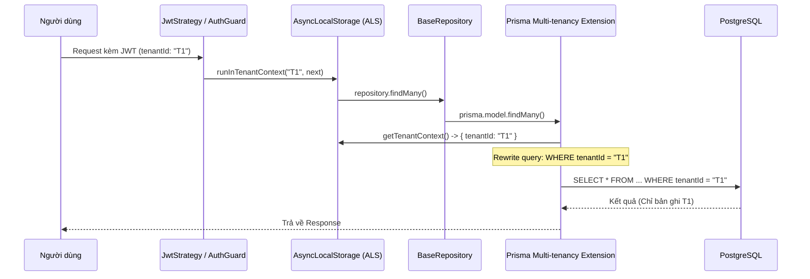

# Multi-tenancy Minh bạch 🏢

EliteNest triển khai multi-tenancy ở lớp thấp nhất có thể của ứng dụng: database driver. Điều này đảm bảo lập trình viên có thể tập trung vào logic nghiệp vụ mà không lo rò rỉ dữ liệu giữa các khách hàng.

## Cách thức hoạt động

Việc triển khai dựa trên hai công nghệ cốt lõi:
1.  **AsyncLocalStorage (ALS)**: Lưu trữ `tenantId` của request hiện tại và chia sẻ nó xuyên suốt call stack.
2.  **Prisma Extensions**: Can thiệp vào mọi thao tác của database để tự động chèn các bộ lọc.

- `SELECT * FROM Product` trở thành `SELECT * FROM Product WHERE tenantId = 'id-tenant-hien-tai'`.

## Luồng Thực thi Nội bộ (Internal Flow)



## Tham chiếu Code: Extension

```typescript
// libs/core/src/database/prisma-extensions.ts

export const multiTenancyExtension = Prisma.defineExtension((client) => {
  return client.$extends({
    query: {
      $allModels: {
        async $allOperations({ model, operation, args, query }) {
          const context = getTenantContext();
          if (context?.tenantId) {
            // Tự động tiêm tenantId vào bộ lọc
            args.where = { ...args.where, tenantId: context.tenantId };
          }
          return query(args);
        },
      },
    },
  });
});
```

## Lợi ích
- **Bảo mật**: Loại bỏ hoàn toàn các lỗi do lập trình viên quên lọc theo `tenantId`.
- **Trải nghiệm Lập trình viên**: Code trong repository trông giống như code single-tenant tiêu chuẩn.
- **Khả năng kiểm chứng**: Chúng ta có thể dễ dàng truy vết mọi thao tác đọc database đến một bối cảnh tenant cụ thể.
