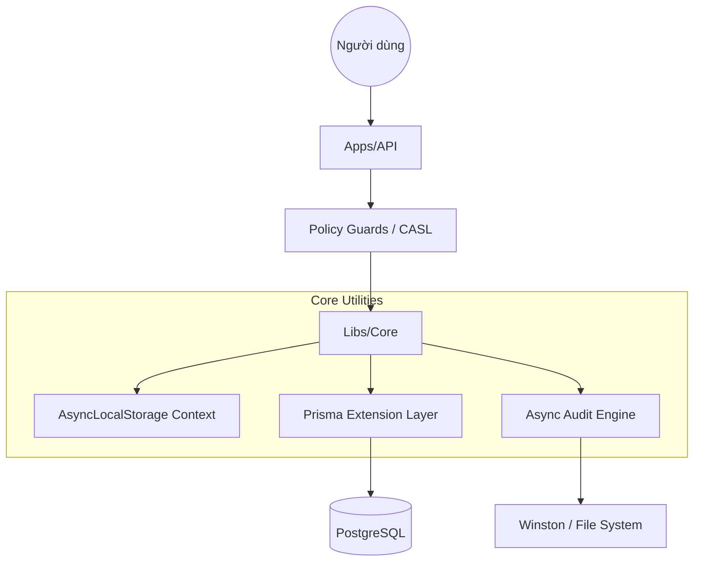

# Hướng dẫn Cấp độ Senior 🛡️

Chào mừng bạn đến với cơ chế vận hành bên dưới của EliteNest. Hướng dẫn này dành cho các kỹ sư cấp cao, những người cần hiểu rõ "Tại sao" và "Như thế nào" đằng sau các trừu tượng cốt lõi của framework.

## Triết lý Kiến trúc

Mục tiêu thiết kế nền tảng của EliteNest là **Quản trị Minh bạch (Transparent Governance)**. Chúng tôi tin rằng các vấn đề chung (cross-cutting concerns) như multi-tenancy, soft-deletion và audit trailing nên được xử lý bởi hạ tầng, không phải bởi logic nghiệp vụ.

### So sánh: Multi-tenancy Thủ công vs Minh bạch

Trong các cách triển khai truyền thống, bạn có thể phải lọc dữ liệu thủ công trong mọi câu truy vấn:

```python
# Thủ công (Rủi ro cao)
def get_products(request):
    return Product.objects.filter(tenant_id=request.tenant.id)
```

Trong EliteNest, chúng tôi sử dụng **Prisma Extensions** kết hợp với **AsyncLocalStorage** để tiêm (inject) bối cảnh này ngay tại tầng database driver.

```typescript
// EliteNest (Minh bạch)
// Lập trình viên chỉ cần gọi:
const products = await this.repository.findMany();

// Hạ tầng sẽ tự động gắn thêm:
// WHERE tenantId = 'id-context-hien-tai' AND deletedAt IS NULL
```

## Kiến trúc Hệ thống



## Đánh đổi Thiết kế (Trade-offs)

1.  **Audit không đồng bộ (Asynchronous Auditing)**: Chúng tôi chọn mô hình "fire and forget" cho audit logs.
    - **Ưu điểm**: Độ trễ API không bị ảnh hưởng bởi quá trình ghi đĩa.
    - **Nhược điểm**: Trong trường hợp hệ thống sập ngay sau khi ghi dữ liệu, một bản ghi log *có thể* bị mất. Với dữ liệu tài chính yêu cầu tuân thủ cao, điều này có thể chuyển sang chế độ đồng bộ trong `AuditDriver`.
2.  **Global Module**: `FrameworkModule` được đánh dấu là `@Global()`.
    - **Đánh đổi**: Tăng thời gian bootstrap ban đầu một chút, nhưng loại bỏ được các lỗi "quên dependency" trong monorepo.

## Tìm hiểu sâu hơn
1.  **Context Provider**: [libs/core/src/database/base.repository.ts](file:///Users/ninja/projects/base/elitenest/libs/core/src/database/base.repository.ts)
2.  **Middleware Glue**: [libs/core/src/auth/strategies/jwt.strategy.ts](file:///Users/ninja/projects/base/elitenest/libs/core/src/auth/strategies/jwt.strategy.ts)
